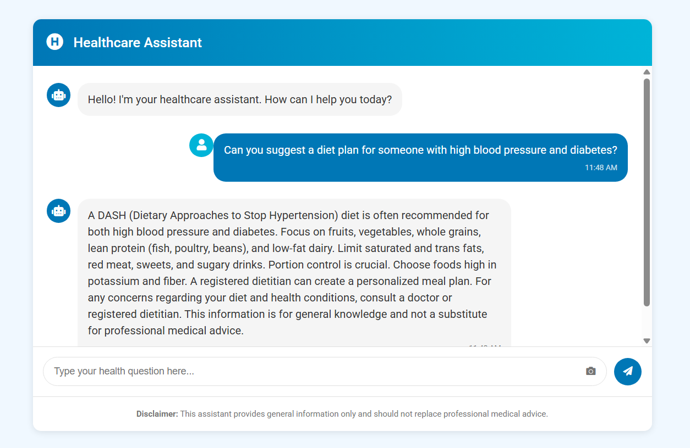
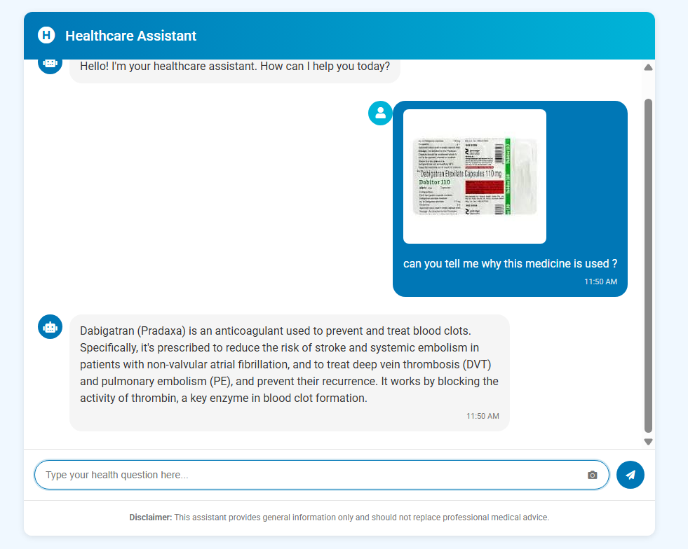
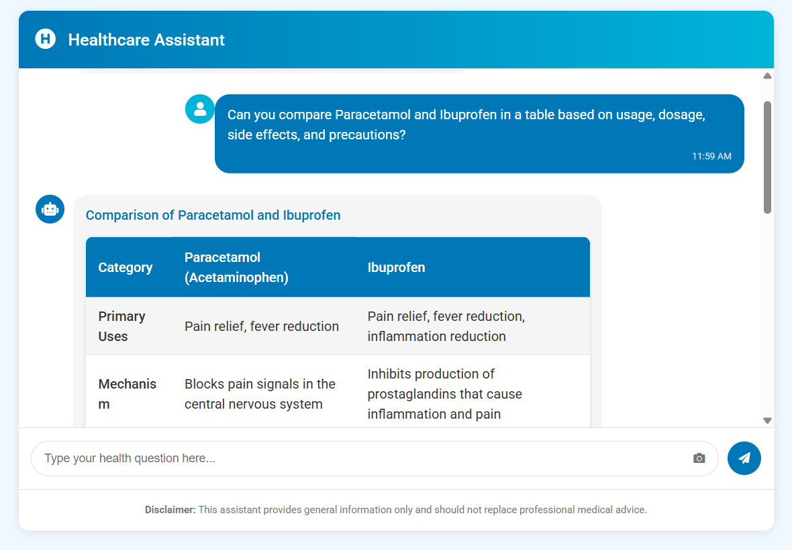

# Healthcare Assistant

A real-time healthcare chatbot application powered by Google's Gemini AI that provides accurate health information, analyzes food/exercise images, and offers personalized advice.

**Healthcare Assistant Interface**



**Image Analysis**



**Comparison**



## Features

- **Health Query Processing**: Answer questions about medical conditions, treatments, wellness, and medications
- **Image Analysis Capabilities**:
  - **Food Analysis**: Calorie estimates, macro nutrients, health benefits
  - **Exercise Analysis**: Form analysis, target muscles, benefits, and safety tips
  - **Medicine Identification**: Usage information for medications
- **Responsive Design**: Works on desktop and mobile devices
- **Real-time Chat Interface**: Clean, intuitive user experience

## Technologies Used

- **Backend**:
  - Python 3.9
  - Flask web framework
  - Google Generative AI (Gemini 1.5 Pro model)
  - Gunicorn WSGI server
- **Frontend**:
  - HTML5
  - CSS3
  - JavaScript
  - Font Awesome icons
- **Deployment**:
  - Docker containerization
  - Environment variable configuration

## Getting Started

### Prerequisites

- Python 3.9 or higher
- Google Generative AI API key ([Get one here](https://ai.google.dev/))

### Installation

1. **Clone the repository**

   ```bash
   git clone https://github.com/yourusername/healthcare-assistant.git
   cd healthcare-assistant
   ```

2. **Create and activate a virtual environment (optional but recommended)**

   ```bash
   python -m venv venv
   # On Windows
   venv\Scripts\activate
   # On macOS/Linux
   source venv/bin/activate
   ```

3. **Install dependencies**

   ```bash
   pip install -r requirements.txt
   ```

4. **Configure API key**

   Create a `.env` file in the project root with your Gemini API key:

   ```
   GEMINI_API_KEY=your_api_key_here
   ```

### Running Locally

```bash
python app.py
```

Then navigate to `http://localhost:5000` in your web browser.

## Docker Deployment

To run the application using Docker:

1. **Build the Docker image**

   ```bash
   docker build -t healthcare-assistant .
   ```

2. **Run the container**

   ```bash
   docker run -p 8080:8080 --env-file .env healthcare-assistant
   ```

3. **Access the application**

   Navigate to `http://localhost:8080` in your web browser.
